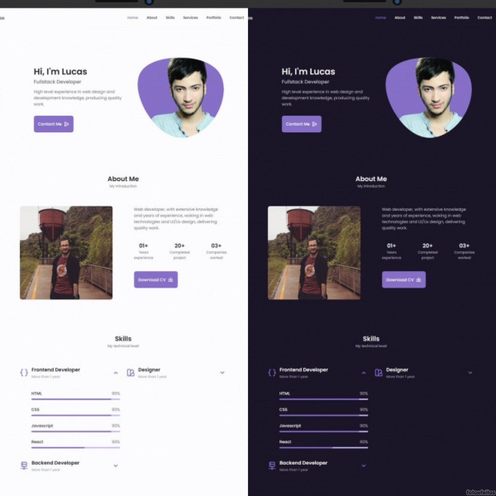
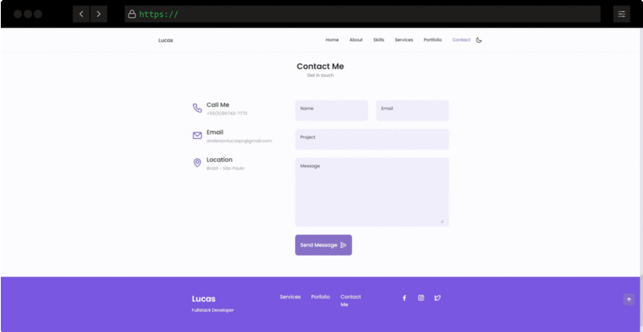
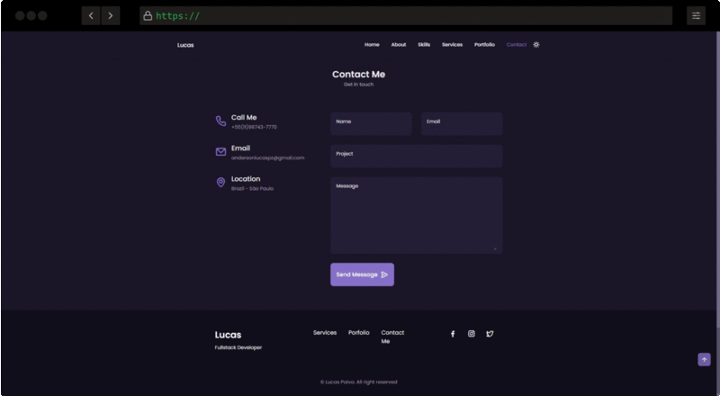

<h1 align="center">
Lucas Portfolio
</h1>

 
  
 

Responsive Portfolio Website Using HTML, CSS and JavaScript. With a beautiful user interface. It contains a Header, Home, About, Skills, Qualification, Services, Portfolio, Project in mind, Testimonial, Contact, Footer and the button to change the theme to light or dark mode.

  

<!-- [//]: # (Add your gifs/images here:)

  
  

 -->

## Features
[//]: # (Add the features of your project here:)
This app features all the latest tools and practices in mobile development!

- 💹 **[Swiper](https://swiperjs.com/)** — A JavaScript library for building the most modern mobile touch slider.
- 💹 **[Blob Generator](https://www.blobmaker.app/)** — Blobmaker is a free generative design tool made with 💕 by z creative labs, to help you quickly create random, unique, and organic-looking SVG shapes.
- 💹 **[Iconscout](https://iconscout.com/unicons)** — My newest favorite web icon library.

## Getting started

You just need to access this [link](https://andersonlucasp.github.io/Principal-Portfolio/#home) and browse the page.

[//]: # (Add your gifs/images here:)

  
  

## License

This project is licensed under the MIT License - see the [LICENSE](https://opensource.org/licenses/MIT) page for details.
